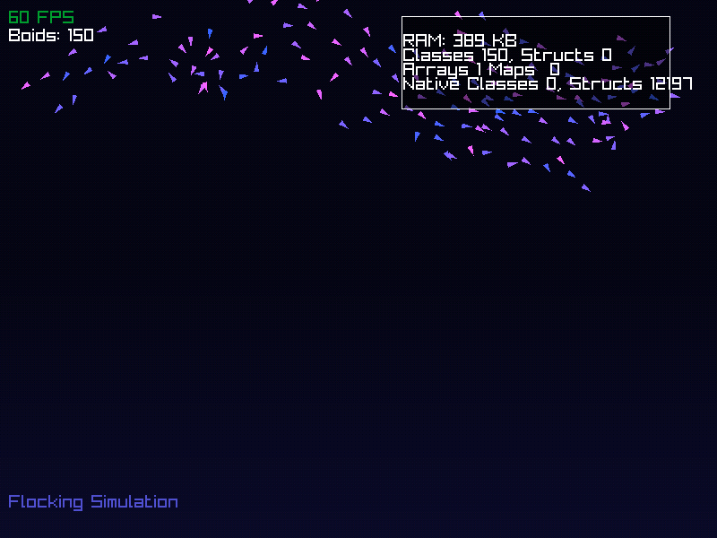
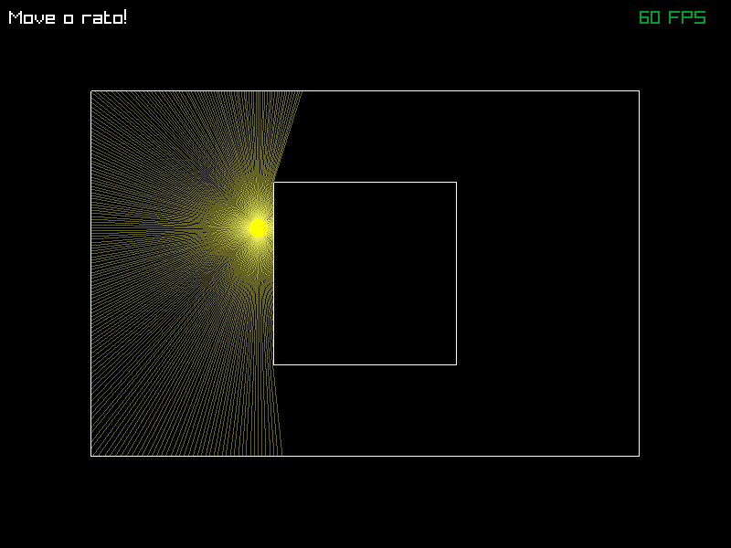
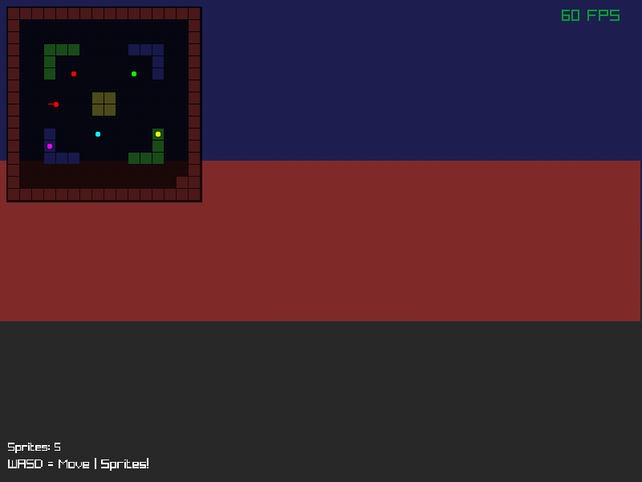
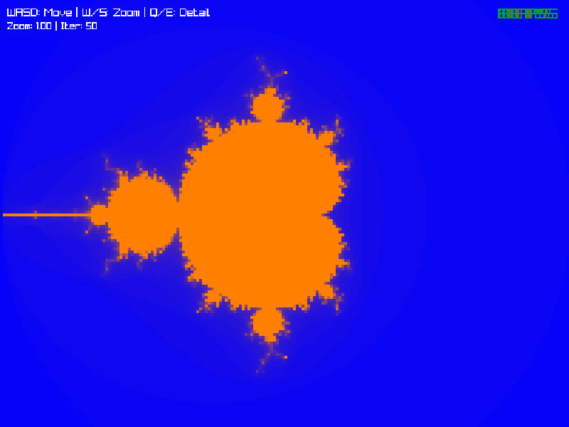
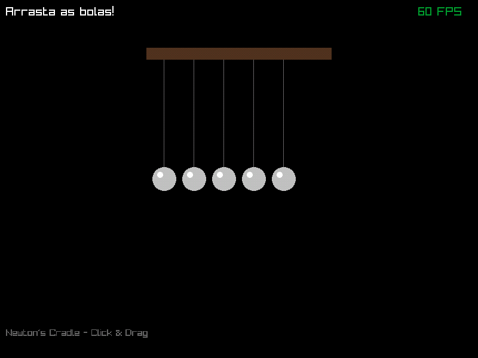
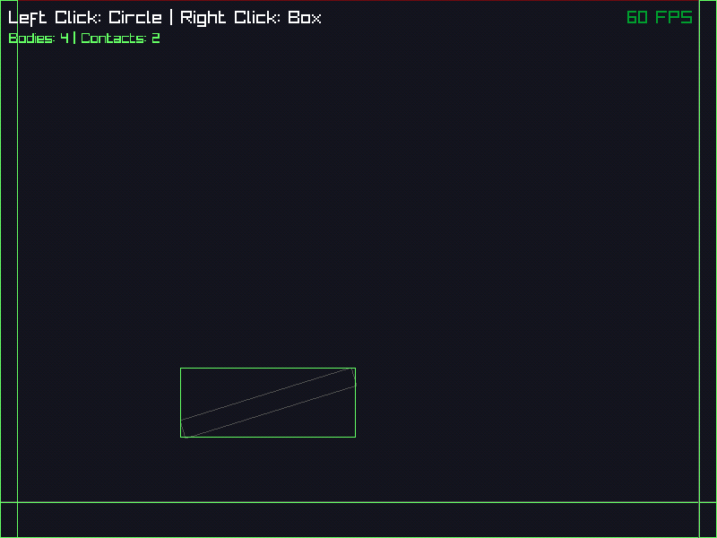
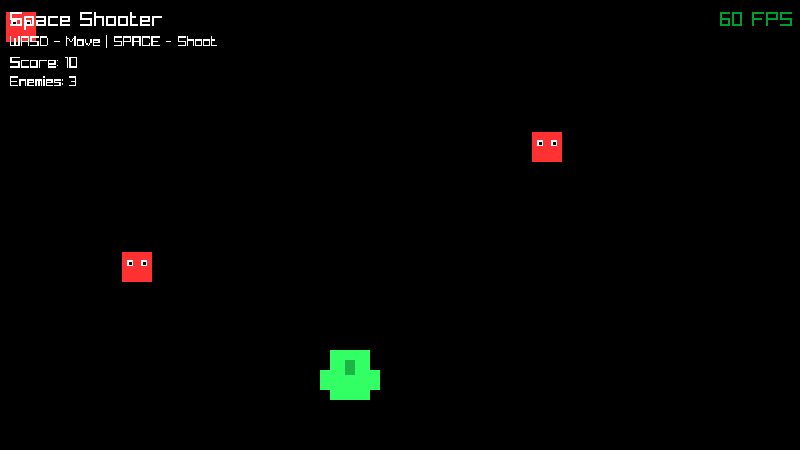
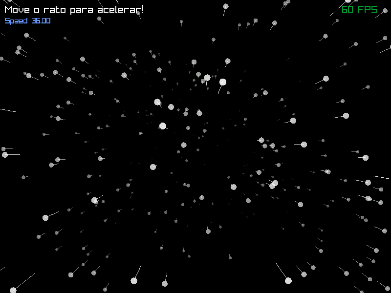
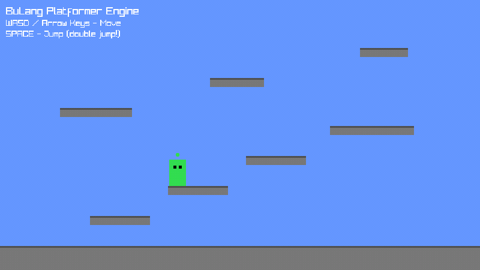
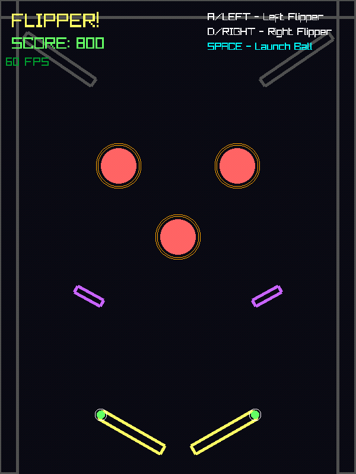

# 🚀 BuLang

**A high-performance stack-based scripting language designed for game engines and concurrent systems.**

[](https://bulang.netlify.app/)
[](LICENSE)
[](https://bulang.netlify.app/playground.html)

---

## 🎯 Overview

BuLang is a modern scripting language that combines simplicity with exceptional performance. Built from the ground up for game development, BuLang excels at handling massive concurrency while maintaining clean, readable syntax. Write game logic fast, execute faster.

🌐 **[Try BuLang Online](https://bulang.netlify.app/)** | 🎮 **[Play Demos](https://bulang.netlify.app/demos.html)** | 📚 **[Documentation](https://bulang.netlify.app/docs.html)**

---


---

## ⚡ Key Features

### 🔥 High Performance VM
- Stack‑based bytecode virtual machine
- Optimized instruction dispatch
- Minimal allocations at runtime
- Predictable execution cost

### 🧠 Designed for Game Development
- Native **Raylib** integration
- Frame‑based execution (`frame` keyword)
- Cooperative multitasking with **processes** and **fibers**
- Perfect for update loops, AI, animations, and gameplay logic

### 🧵 Fibers & Processes
- Run **tens of thousands** of concurrent tasks
- No OS threads, no locks, no context‑switch overhead
- Deterministic scheduling

```bulang
process enemy() {
    while (true) {
        move();
        frame;
    }
}
```

### 🧱 Object‑Oriented Programming
- Classes with inheritance
- Structs for lightweight data
- Method chaining support

```bulang
class Player {
    def init(name, hp) {
        self.name = name;
        self.hp = hp;
    }
}
```

### 📦 Arrays, Maps & Built‑in Types
- Dynamic arrays and hash maps
- Python‑style indexing (including negative indexes)
- Rich built‑in methods (`push`, `pop`, `len`, `keys`, etc.)

### 🔄 Control Flow Power
- `if / elif / else`
- `for`, `while`, `do‑while`
- `switch` (no fallthrough)
- `break` / `continue`
- Low‑level `goto` and `gosub` for state machines

### 🔀 Multi-Value Returns (New)
- Functions can return **multiple values** simultaneously
- Unpack into multiple variables with `var (a, b, c) = func()`
- Native functions support multi-return natively
- No tuple overhead, pure stack efficiency

```bulang
# Function returning 3 values
def get_position() {
    return (100, 200, 5);
}

# Unpack into variables
var (x, y, z) = get_position();

print(x, y, z);  # 100 200 5
```

---

## 🧹 Optional Garbage Collector (New)

BuLang now includes a **simple mark‑and‑sweep garbage collector**, designed specifically for real‑time applications:

- ✔ Can be **enabled or disabled**
- ✔ Can be **triggered manually**
- ✔ Avoids unexpected frame spikes
- ✔ Perfect for games and simulations

This allows developers to **control exactly when memory cleanup happens**, preventing stutters during gameplay.

---

## 🧩 Native Module System

BuLang features a **zero‑overhead native module system**:

- Compile‑time resolution of native calls
- No string lookups at runtime
- Tree‑shaking: only used functions are registered
- Supports `import` (namespaced) and `using` (flat)

```bulang
import raylib;
using raylib;

InitWindow(800, 600, "BuLang Game");
```

#### Built-in Modules

| Module | Description |
|--------|-------------|
| `math` | Mathematical functions |
| `time` | Time and date operations |
| `file` | File read/write |
| `fs` | Filesystem operations |
| `path` | Path manipulation |
| `os` | System operations |
| `socket` | TCP/UDP networking |
| `json` | JSON parsing/encoding |
| `regex` | Regular expressions |
| `zip` | ZIP archive handling |
| `crypto` | Base64, Hex, Hashing, UUID |
| `nn` | Neural networks (MiniDNN) |


### 📚 Easy to Learn
Clean syntax, comprehensive documentation, interactive playground, and working game examples to learn from.

---

## 🎮 Live Demos

Try these fully playable games built with BuLang directly in your browser:

| Demo | Demo | Demo |
|------|------|------|
|  |  |  |
|  |  |  |
|  |  |  |
|  |  |   |

 
---

## 🚀 Quick Start
 
### Installation

```bash
# Clone the repository
git clone https://github.com/akadjoker/BuLangVM.git
cd bulang

# Build (instructions may vary - check repository for details)
make
```

### Hello World

```bulang
# Define a function
def greet(name) {
    print("Hello, " + name + "!")
}

# Call it
greet("World")
```

### Try Online

The fastest way to get started is our **[online playground](https://bulang.netlify.app/playground.html)** - no installation required!

---

## 📊 Performance Stats

| Metric | Value |
|--------|-------|
| **Concurrent Processes** | 50,000+ |
| **Frame Time** | 0.2ms |
| **Runtime Size** | 200KB |
| **Bytecode Opcodes** | 80+ |
| **License** | MIT |


---

## ✨ Why BuLang?

BuLang was built with a very clear goal:

> *Provide scripting performance close to native code, without sacrificing simplicity or flexibility.*

It is especially suited for:
- 🎮 Game logic and gameplay scripting
- 🤖 AI behaviors and state machines
- 🔁 Massive concurrent logic (fibers / processes)
- ⚡ Performance‑critical runtime scripting

---

## 🎯 Use Cases

### Game Development
- **AI Behaviors**: Implement complex NPC logic and decision trees
- **Game Rules**: Script game mechanics and event systems
- **Entity Systems**: Manage thousands of concurrent entities efficiently

### Simulation
- **Multi-Agent Systems**: Run large-scale simulations with ease
- **Procedural Generation**: Create dynamic content on the fly
- **Physics Systems**: Script physics interactions and behaviors

### Rapid Prototyping
- **Quick Iteration**: Test gameplay ideas without recompiling
- **Live Reloading**: Modify scripts during runtime
- **Easy Debugging**: Clear error messages and stack traces

---

## 📖 Documentation

Comprehensive documentation is available at [bulang.netlify.app](https://bulang.netlify.app/), including:

- **Language Reference**: Complete syntax and semantics guide
- **API Documentation**: Built-in functions and libraries
- **Tutorials**: Step-by-step learning paths
- **Examples**: Real-world code samples
- **Performance Tips**: Optimization best practices
- **[API Reference](API.md)** - Complete built-in functions and modules
- **[Built-in Methods](BUILTIN_METHODS.md)** - String, Array, Map, Buffer methods

---

## 🛠️ Built With

- **Raylib Integration**: 2D/3D game development
- **Canvas 2D Support**: Web-based graphics
- **Custom Engine Support**: Easy to integrate with your own engine


## 🛠 Status

BuLang is under **active development**.

Current focus:
- VM optimizations
- Garbage collector tuning
- More native modules
- Tooling & debugging support

---

## 🎯 Vision

BuLang aims to become:

> **A serious scripting language for real‑time systems and games**,
> combining the **performance of low‑level languages** with the **flexibility of scripting**.


---

## 🗺️ Roadmap

Check out our [roadmap](https://bulang.netlify.app/roadmap.html) to see what's coming next!

---

## 🤝 Contributing

BuLang is actively developed and welcomes contributions! Whether you're:
- 🐛 Fixing bugs
- ✨ Adding features
- 📝 Improving documentation
- 🎮 Creating demos

Your help is appreciated! Please check our contributing guidelines (if available) and feel free to open issues or pull requests.

---


## 📜 License

BuLang is licensed under the **MIT License** - see the [LICENSE](LICENSE) file for details.

---

## 🌟 Why Choose BuLang?

### For Game Developers
- **Performance First**: Optimized for real-time game scenarios
- **Massive Concurrency**: Handle thousands of entities without breaking a sweat
- **Simple Integration**: Drop into existing projects with minimal friction

### For Beginners
- **Clean Syntax**: Easy to read and write
- **Interactive Learning**: Try code in the browser playground
- **Working Examples**: Learn from complete, playable games

### For Advanced Users
- **Low-Level Control**: Direct access to performance-critical operations
- **Predictable Performance**: No garbage collection pauses
- **Extensible**: Easy to add custom functions and libraries

---

## 📞 Community & Support

- **Website**: [bulang.netlify.app](https://bulang.netlify.app/)
- **GitHub**: [github.com/akadjoker/bulang](https://github.com/akadjoker/BuLangVM)

---

## 🙏 Acknowledgments

Made with ❤️ for game developers.

---

<p align="center">
  <strong>Ready to build your game?</strong><br>
  <a href="https://bulang.netlify.app/playground.html">Try the Playground</a> • 
  <a href="https://bulang.netlify.app/docs.html">Read the Docs</a> • 
  <a href="https://bulang.netlify.app/demos.html">Play Demos</a>
</p>
